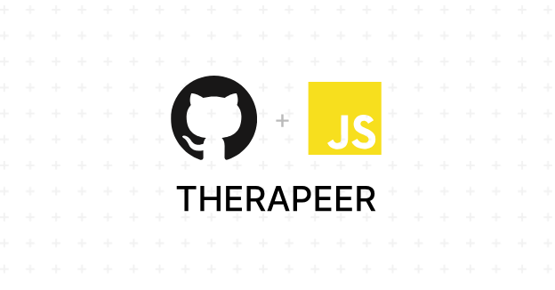

# THERAPEER



Therapeer is an online mental health therapy platform designed to provide accessible and effective therapy services. It connects users with professional therapists for private text-based sessions, public chatrooms and appointment booking. This project is for individuals seeking mental health support and administrators or therapists managing therapy services online

---

## 🚀 Demo

[Visit Therapeer](https://therapeer-frontend.onrender.com/)

---

## 🧐 Features

- ✔️ User registration and login
- ✔️ Therapist profile listing and filtering
- ✔️ Admin dashboard to manage therapists
- ✔️ Appointment booking
- ✔️ Private text-based therapy sessions
- ✔️ Public chatroom

---

## 🛠️ Installation Steps

1. **Clone the repository**

    ```bash
    git clone https://github.com/Asaa03/THERAPEER.git
    ```

2. **Navigate to project**

    ```bash
    cd THERAPEER
    ```

3. **Backend setup**

    ```bash
    cd backend
    npm install
    npm start
    ```

4. **Frontend setup**

    ```bash
    cd ../frontend
    npm install
    npm run dev
    ```

---

## ⚙️ Environment Variables

### Frontend

- Create a `.env` file inside the **frontend folder** with:
```env
VITE_BACKEND_URL=http://localhost:5001
```

- Update backendUrl in AppContext.jsx, AdminContext.jsx, TherapistContext.jsx, and Login.jsx to
```bash
backendUrl = 'http://localhost:5001'
```

- Create `.env` file inside the  **main folder** i.e THERAPEER and write following things:
```bash
PORT=5001
MONGODB_URI='YOUR_MONGODB_URI' 
CLOUDINARY_NAME='YOUR_CLOUDINARY_NAME' 
CLOUDINARY_API_KEY='CLOUDINARY_API_KEY' 
CLOUDINARY_SECRET_KEY='CLOUDINARY_SECRET_KEY' 
ADMIN_EMAIL='WRITE EMAIL FOR ADMIN LOGIN' 
ADMIN_PASSWORD='ADMIN PASSWORD' 
JWT_SECRET='minor2'
```
---

## 💻 Built with
```bash
Frontend: React Tailwind CSS
Backend: Node.js Express.js MongoDB
Auth: JWT
Media Storage: Cloudinary
```
---

## 🍰 Contribution Guidelines

Pull requests are welcome. For major changes, please open an issue first to discuss what you would like to change.